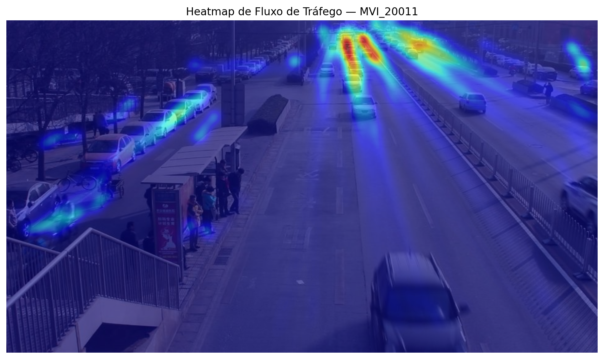

# Análise de Fluxo de Tráfego com Visão Computacional

Detecção, rastreamento e análise de fluxo de veículos em vídeo de trânsito urbano, utilizando YOLOv8 + ByteTrack sobre o dataset UA-DETRAC.

Projeto desenvolvido como estudo prático de visão computacional aplicada à mobilidade urbana, conectando técnicas de detecção de objetos, rastreamento multi-alvo e análise exploratória de dados espaciais.

## Motivação

Este projeto foi construído como exercício prático para aprofundar conhecimentos em visão computacional, partindo de experiência prévia em Machine Learning, Deep Learning e processamento de sinais (aplicados anteriormente a diagnóstico de falhas em máquinas elétricas). O objetivo foi explorar como as mesmas bases teóricas — extração de características, classificação, análise temporal — se aplicam a um domínio diferente: mobilidade urbana e análise de tráfego.

## Pipeline

1. **Dados**: sequência de vídeo do dataset [UA-DETRAC](https://detrac-db.rit.albany.edu/), com anotações XML originais (bounding boxes + tipo de veículo).
2. **Validação das anotações**: parsing dos XMLs e verificação visual cruzada em múltiplos frames (início, meio e fim da sequência).
3. **Detecção**: YOLOv8 (Ultralytics), pré-treinado em COCO, com ajuste de `confidence` e resolução de inferência para reduzir falsos negativos em veículos distantes/pequenos — limitação comum em câmeras de ângulo elevado.
4. **Rastreamento**: ByteTrack, associando detecções entre frames via IoU + Kalman Filter, atribuindo ID persistente a cada veículo.
5. **Filtragem de ruído**: remoção de trajetórias muito curtas (falsos positivos) e de veículos estacionados (sem deslocamento real), isolando apenas fluxo em movimento.
6. **Heatmap de fluxo**: densidade espacial normalizada por trajetória (não por frame), evitando viés de veículos parados que permanecem mais tempo na cena.
7. **Métricas**: contagem de veículos únicos, direção predominante de fluxo, velocidade relativa (px/s).

## Resultados



- **187 veículos únicos** rastreados na sequência analisada.
- Densidade de fluxo concentrada corretamente na via principal após correção de viés do heatmap (normalização por trajetória).
- Distribuição de direção com picos claros, consistentes com uma via de fluxo bidirecional.

## Decisões técnicas e problemas resolvidos

Alguns desafios reais do desenvolvimento, documentados por transparência técnica:

- **Falsos negativos em veículos distantes**: resolvido testando modelo (`yolov8n` → `yolov8m`), threshold de confiança e resolução de inferência isoladamente, para isolar a variável de maior impacto.
- **Viés no heatmap**: a primeira versão do heatmap media *tempo de permanência* (favorecendo carros estacionados) em vez de *fluxo* — corrigido normalizando a contribuição de cada trajetória pelo seu próprio comprimento.
- **Trajetórias fragmentadas**: filtro de comprimento mínimo para reduzir ruído de tracking sem descartar veículos legítimos.

## Limitações

- Sem calibração de câmera: velocidades reportadas são relativas (px/s), não convertidas para km/h.
- Análise temporal (padrões cíclicos de tráfego via FFT/STFT) não foi incluída: a sequência disponível tem duração de segundos, insuficiente para extrair periodicidade real. Fica registrado como possível extensão futura, com dados de múltiplas horas do mesmo local.
- Detecção usa modelo pré-treinado genérico (COCO), sem fine-tuning específico para o domínio de tráfego — suficiente para prova de conceito, mas com espaço para ganho de precisão.

## Próximos passos

- Fine-tuning do YOLO no próprio UA-DETRAC para melhorar recall em veículos pequenos.
- Calibração de câmera para métricas de velocidade real.
- Extensão para múltiplas câmeras/interseções, permitindo análise temporal legítima.

## Tecnologias

Python · PyTorch · Ultralytics YOLOv8 · ByteTrack · OpenCV · NumPy · Pandas · Matplotlib

## Como executar

```bash
pip install -r requirements.txt
jupyter notebook notebooks/pipeline_completo.ipynb
```

## Autor

Cristiano da Silva Araújo — Mestrando em Ciência da Computação (IFCE), com background em Engenharia Mecatrônica e experiência em Machine Learning aplicado a processamento de sinais.
[LinkedIn](https://linkedin.com/in/cristiano-araújo-8172191a3/) · [GitHub](https://github.com/ohyescris)
